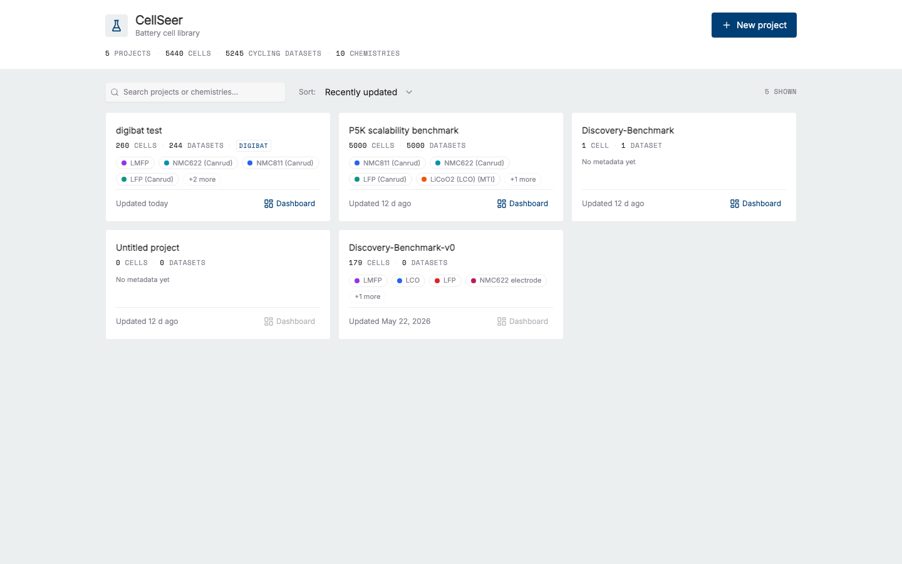
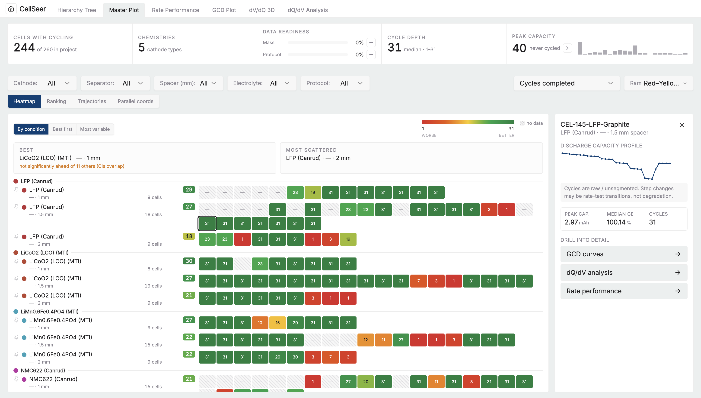
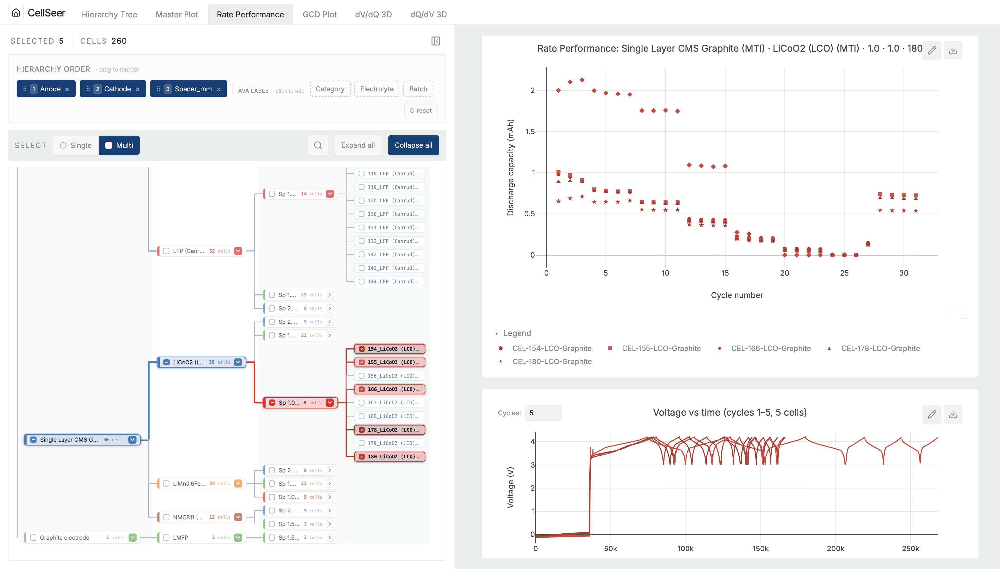
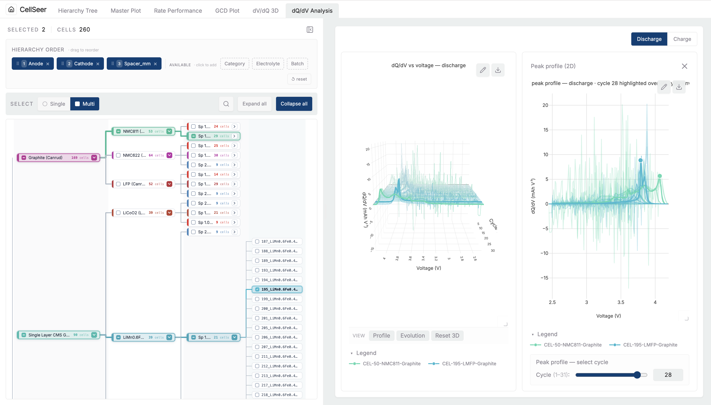

# CellSeer

**Battery cell analysis platform: link cycling data to experimental metadata, compare whole campaigns, drill into any cell.**

[](LICENSE)
[](https://www.python.org/)
[](https://react.dev/)
[](https://fastapi.tiangolo.com/)

Built for material scientists, lab managers, and battery researchers. Grew out of an **Imperial College London MEng Design Engineering** thesis, with integration with Imperial's **DIGIBAT** DataLab.

| | |
|---|---|
|  |  |
|  |  |

## Features

- **Multi-project library**: organise campaigns in separate projects; each opens a full analysis dashboard
- **Hierarchy tree**: filter cells by metadata dimensions (cathode, anode, electrolyte, separator, spacer)
- **Master Plot**: campaign overview with condition heatmap, ranking, trajectories, parallel coordinates, and a per-cell inspector
- **GCD plot**: galvanostatic charge/discharge curves (V vs Q)
- **dQ/dV & dV/dQ**: 3D differential capacity and voltage plots with peak analysis
- **Rate performance**: capacity vs cycle across C-rates
- **Protocol attachment**: attach cycle-range / C-rate segments to cells (protocol-scoped retention and fade are planned, not yet computed)
- **File upload & ingest**: metadata spreadsheets and cycler files (Neware, BioLogic, Arbin via [PyProBE](https://github.com/uk-amrc/PyProBE))
- **DIGIBAT sync**: mirror Imperial DataLab collections to local SQLite + Parquet for offline dashboards
- **Annotations**: per-cell notes and tags
- **Shareable views**: dashboard tab and filter state live in the URL

## Built With

| Layer | Technology | Role |
|-------|------------|------|
| **Frontend** | React 18, TypeScript, Vite, TanStack Query, Plotly, shadcn/ui | SPA dashboards, shared selection state, REST client |
| **Backend** | FastAPI, SQLite, Parquet data lake, orjson | REST API, ingest, caching, DIGIBAT sync; serves built SPA in production |
| **[`cellseer`](cellseer/)** | Python, Plotly, optional PyProBE | Standalone plotting library for notebooks and scripts |
| **[`cellseer-lib`](packages/cellseer-lib/)** | TypeScript (framework-free) | Plotly figure builders used by React dashboards |

## Getting Started

### Prerequisites

- **Python** 3.9 or newer (3.12 recommended)
- **Node.js** current LTS (for the frontend build)
- **Git**

### Local development

From the repository root:

```bash
# 1. Python environment
python3 -m venv .venv
source .venv/bin/activate          # Windows: .venv\Scripts\activate
pip install -r backend/requirements.txt

# 2. Frontend dependencies
cd frontend && npm install && cd ..
```

**Terminal 1 (backend)** (port 8000):

```bash
source .venv/bin/activate
python -m uvicorn backend.api:app --host 127.0.0.1 --port 8000 --reload
```

**Terminal 2 (frontend)** (port 8080, proxies `/api` to `:8000`):

```bash
cd frontend
npm run dev
```

Open [http://localhost:8080](http://localhost:8080). When `CELLSEER_API_TOKEN` is unset, all API routes are open, which is intentional for local dev.

> **Tip:** From `frontend/`, `npm run api` starts the backend using the repo's `.venv` if you prefer a single-directory workflow.

For production Docker deployment see **[DEPLOY.md](DEPLOY.md)**.

## Usage

A typical workflow:

1. **Create a project** on the home page (or open an existing one).
2. **Ingest data**: upload a metadata spreadsheet and cycler files, or sync from DIGIBAT.
3. **Wait for readiness**: the project detail page shows ingest progress; cycling data lands as Parquet in `data_lake/` with metadata in SQLite.
4. **Open the dashboard** at `/projects/:projectId/dashboard`.
5. **Explore**: start with the Hierarchy Tree or Master Plot for campaign-level views; select cells and drill into GCD, dQ/dV, dV/dQ, or Rate Performance tabs.
6. **Attach protocols** (optional): record the cycle-range / C-rate segmentation for cells whose cycle indices mix formation, rate tests, and main cycling. Protocol-scoped retention and fade metrics are planned but not yet computed.

Dashboard tabs are URL-addressable (`?tab=tree`, `?tab=particle-master`, `?tab=rateperf-hier`, etc.) so colleagues can open the same view from a shared link.

## Documentation

The interactive API reference is available at [http://localhost:8000/docs](http://localhost:8000/docs) (FastAPI OpenAPI) when the backend is running.

<details>
<summary><strong>Optional: DIGIBAT sync</strong></summary>

CellSeer can mirror DIGIBAT collections into local SQLite + Parquet so dashboards work offline.

Add credentials to `backend/.env`:

```bash
DATALAB_BASE_URL=https://digibat.dept.ic.ac.uk
DATALAB_API_KEY=your_api_key
DATALAB_TIMEOUT=60
```

CLI sync:

```bash
python backend/scripts/sync_digibat.py \
  --project "your-project-name" \
  --collections "collection-id-1,collection-id-2" \
  --db-path "backend/cellseer.db" \
  --data-lake-dir "data_lake"
```

Useful flags: `--dry-run`, `--full-resync`, `--no-cycling`, `--max-items N`, `--purge`, `--verbose`.

</details>

<details>
<summary><strong>Optional: custom database paths</strong></summary>

By default the backend uses `backend/cellseer.db` and `data_lake/`. Override with:

```bash
export CELLSEER_DB_PATH="/path/to/your.db"
export CELLSEER_DATA_LAKE_DIR="/path/to/data_lake"
python -m uvicorn backend.api:app --host 127.0.0.1 --port 8000 --reload
```

Minimum tables: `project`, `cell`, `dataset` (with `cycling`, `discharge_dqdv`, `discharge_dvdq` datasets for full dashboard coverage).

</details>

## Project Structure

```
CellSeer/
├── frontend/                 # React + Vite SPA (port 8080)
│   └── src/
│       ├── features/         # masterPlot, gcdPlot, differential, ratePerformance, hierarchy, protocol
│       └── digibat/          # DIGIBAT sync page, API client, and hooks
├── packages/
│   └── cellseer-lib/         # TypeScript Plotly figure builders (framework-free npm package)
├── backend/                  # FastAPI + SQLite + Parquet
│   ├── routers/              # REST endpoints (cells, upload, projects, digibat, …)
│   ├── cellseer/             # embedded Python lib: readers, analysis, ingest
│   ├── digibat/              # DIGIBAT client + sync service
│   └── scripts/              # sync_digibat.py, import scripts
├── cellseer/                 # pip-installable Python plotting package
├── data_lake/                # Parquet time series (gitignored)
├── docker-compose.yml
├── Dockerfile
└── DEPLOY.md
```

## Testing

**Frontend** (Vitest):

```bash
cd frontend
npm run test
```

**cellseer** (pytest):

```bash
pip install -e "cellseer[test]"
python -m pytest cellseer/tests -q
```

**Backend** (Master Plot parity, peak-shift, rate-performance scope):

```bash
python -m pytest backend/tests -q
```

## Known Limitations

| Area | Constraint |
|------|------------|
| **Database** | SQLite single-writer (one app instance per DB file); Postgres migration planned but not implemented |
| **Scale** | Tested around ~5 k cells; behaviour at larger scale unknown |
| **Auth** | Single shared bearer token; no per-user accounts, roles, or SSO |
| **Testing** | No CI gates or E2E browser tests in repo; mostly unit tests on pure functions |
| **Offline** | Requires a running backend (or a cached DIGIBAT mirror) |
| **Protocol-scoped metrics** | Retention, fade rate, cycle life and CE drift need a segmented cycle sequence (formation, rate-test and main cycling separated). That computation is not built yet, so these metrics are never shown as a number: without a protocol they read "needs a protocol", and once a protocol is attached they read "coming soon" |

Honest metrics: retention and fade rate are never reported as a misleading whole-series figure. They stay locked until a protocol is attached, then show "coming soon" until segment-aware computation lands.

## License

Distributed under the MIT License. See [LICENSE](LICENSE) for the full text.

Copyright (c) 2026 Shirley Xiong.

## Acknowledgments

- **Imperial College London**: MEng Design Engineering programme and battery research community
- **[DIGIBAT](https://digibat.dept.ic.ac.uk)** / Imperial DataLab: remote collection sync; the local `data_lake/` layout (SQLite catalogue plus Parquet time series per cell/dataset) was *informed by* DataLab's collection and provenance model. CellSeer is an independent app, not an official DataLab product.
- **[PyProBE](https://github.com/uk-amrc/PyProBE)**: cycler file reading (Neware, BioLogic, Arbin)
- **[Plotly](https://plotly.com/)**: interactive charts across web app, `cellseer`, and `cellseer-lib`
- Formative user interviews (11 participants) that shaped the overview, inspect, and drill workflow
