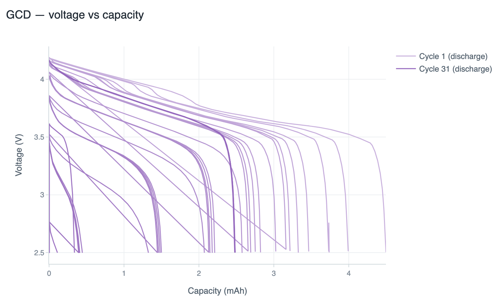
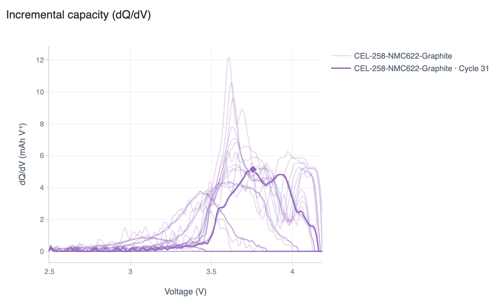
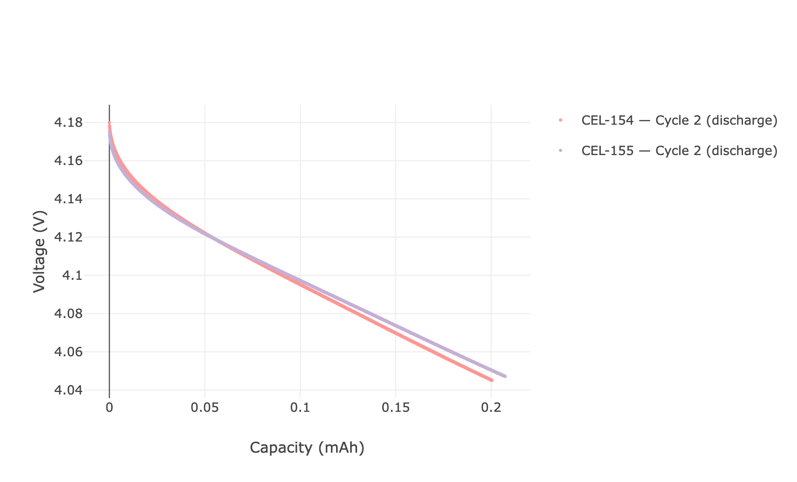
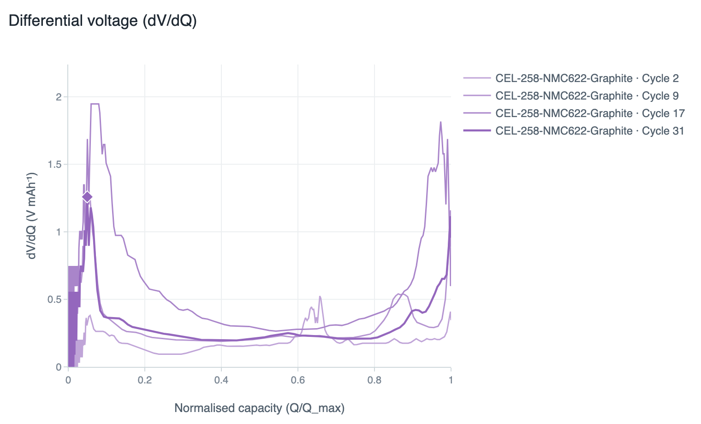
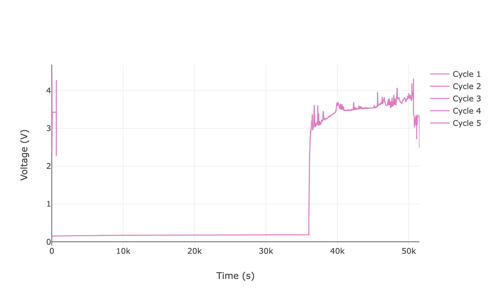
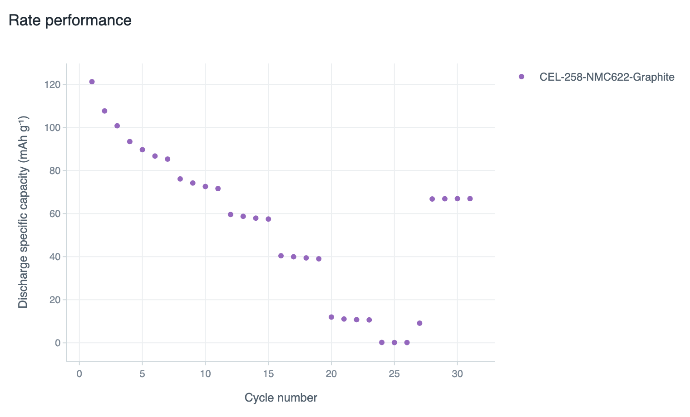

# cellseer

Reusable, callable plotting functions for battery analysis.

Licensed under the [MIT License](LICENSE).

---

## Gallery

| GCD — voltage vs capacity | Incremental capacity (dQ/dV) |
|:---:|:---:|
| [](../docs/assets/gallery/gcd.png) | [](../docs/assets/gallery/dqdv.png) |
| Galvanostatic charge–discharge curves, one trace per cycle. | Phase-transition peaks vs voltage — 3D surface or 2D cycle overlay. |

| GCD — multi-cell comparison | Differential voltage (dV/dQ) |
|:---:|:---:|
| [](../docs/assets/gallery/gcd_multi.png) | [](../docs/assets/gallery/dvdq.png) |
| Replicate cells overlaid; labels carry through to the legend. | Electrode-balance features vs capacity — 3D surface or 2D overlay. |

| Voltage vs time | Rate performance |
|:---:|:---:|
| [](../docs/assets/gallery/voltage_time.png) | [](../docs/assets/gallery/rate.png) |
| Raw protocol trace for the first cycles — formation checks. | Per-cycle discharge capacity with C-rate segmentation. |

> All figures above were generated from real cycling data by [`cellseer/examples/gallery.py`](examples/gallery.py).
> Click any thumbnail to view full size.

---

## Install

From the CellSeer repo root:

```bash
pip install -e cellseer
```

Or from PyPI (when published):

```bash
pip install cellseer
```

Extras:

- `pip install 'cellseer[neware]'` for Neware xlsx input
- `pip install 'cellseer[pyprobe]'` for optional PyProBE compute path
- `pip install 'cellseer[dash]'` for Dash dashboard serving

---

## Quickstart

All plotters accept the same input shapes — file path, DataFrame, dict,
`CellData`, or a `{name: input}` map for multi-cell figures — plus optional
`direction={'discharge','charge'}` and `cycler={'auto', 'neware', 'biologic', ...}`.

```python
import cellseer

cell = cellseer.load("sample.csv")          # or pass a DataFrame / Parquet path

cellseer.gcd_plot(cell).show()              # GCD — voltage vs capacity
cellseer.dqdv_plot(cell).show()             # dQ/dV — incremental capacity (3D)
cellseer.dvdq_plot(cell).show()             # dV/dQ — differential voltage (3D)
cellseer.rate_plot(cell).show()             # capacity vs cycle
cellseer.voltage_time_plot(cell).show()     # voltage vs time (formation trace)
```

Multi-cell comparison — pass a dict or list:

```python
cells = {name: cellseer.load(path) for name, path in my_files.items()}
cellseer.gcd_plot(cells, cycles=[1, 2, 5]).show()
```

Select a specific cycle slice or direction:

```python
cellseer.dqdv_plot(cell, direction="charge").show()
cellseer.dvdq_plot(cell, mode="2d", cycleIndex=3).show()
```

---

## Dash dashboards

Requires `pip install 'cellseer[dash]'`.

```python
from cellseer import dqdv_dashboard, dvdq_dashboard, gcd_dashboard, rate_dashboard

dqdv_dashboard("sample.csv", serve=True)    # combined 3D surface + 2D peak overlay
dvdq_dashboard("sample.csv", serve=True)    # dV/dQ equivalent
gcd_dashboard("sample.csv", serve=True)     # GCD scatter + cumulative + V/t
rate_dashboard("sample.csv", serve=True)    # capacity vs cycle + V/t
```

---

## Demo runner

Synthetic data is used automatically when no input is provided, so the script
works in a bare checkout with no data lake:

```bash
python examples/demo_plots.py --plot gcd     [--dashboard] [--serve] [--mode scatter|cumulative]
python examples/demo_plots.py --plot dqdv    [--dashboard] [--serve] [--mode 3d|2d]
python examples/demo_plots.py --plot dvdq    [--dashboard] [--serve] [--mode 3d|2d]
python examples/demo_plots.py --plot rate    [--dashboard] [--serve]
```

---

## Note on naming

This directory (`cellseer/`) is the **pip-installable plotting library**,
imported as `cellseer`. The CellSeer server embeds a *separate* internal
package at `backend/compute/` (imported as `compute`) for ingest and analysis.
They are different packages with different names — the server does **not** use
this standalone library. See the repo README for details.

---

## License

`cellseer` is distributed under the **MIT License**. See [LICENSE](LICENSE) for the full text.

Copyright (c) 2026 CellSeer.
